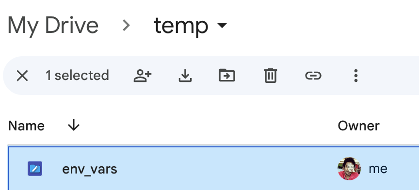

# LLM Dojo

Learning course on Large Language Models (LLMs), designed to provide hands-on experience using Jupyter Notebooks. This course is structured into four main parts, each focusing on different aspects of LLMs and their applications.

## Dojo Structure

- [x] Part 1: [Understanding LLMs](./gpt-api/README.md)
  - **How LLMs Work, Models, Format, Tokens**: An introduction to the fundamentals of LLMs, exploring their architecture, model formats, and tokenization methods.
  - **Classification, Moderation**: Techniques in classification and moderation using LLMs.
  - **Chain of Thought, Prompting Chains**: Exploring advanced prompting strategies including chain of thought.
  - **Output Validations**: Methods for validating and ensuring the quality of outputs generated by LLMs.

- [ ] Part 2: Advanced Prompt Engineering
  - **Prompt Engineering Deep Dive**: An in-depth exploration of prompt engineering techniques.
  - **Evaluation and Testing**: Methods for evaluating and testing LLMs.
  - **Prompt Techniques Exploration**: Investigation of various prompt engineering techniques.
  - **N-shot, Retrieval-Augmentation, Generated Knowledge Prompt, Tree-of-Thought**: Advanced prompting strategies.
  - **Ethical Prompt Hacking**: Understanding the ethics involved in prompt manipulation.

- [ ] Part 3: Frameworks and Models
    - **Langchain Framework Exploration**: An exploration of the Langchain  framework.
    - **Autonomous AGIs, AutoGPT, GPT-Engineer, Smol**: Discussion on   various  autonomous AI models and tools.
    - **Different Models, LLAMA, PALM2, Anthropic**: Overview of various    LLMs  including LLAMA, PALM2, and Anthropic.
    - **Platforms for AI Apps**: Examination of platforms suitable for AI   application development.

- [ ] Part 4: Beyond Text - Diffusion Models and Custom Training
    - **How Diffusion Models Work**: Understanding the workings of diffusion    models.
    - **Training Models with Your Data**: A guide to training models using  your own datasets.

## Getting Started

To get started with the course:
1. Clone this repository.
2. Ensure you have Jupyter Notebook environment.
3. Navigate through the directories for each part and follow the instructions in the notebooks.

### Using google colab FREE
You can also use Google Colab **for FREE** as an alternate to running locally. 

- There is an "open in colab" button on top of each of the notebook. This should open it in a colab environment on your own Google account
- To keep the notebook secure, DO NOT put keys directly in the notebook. 
- **Setting up environment variables in google colab** : Since there is no clean way of setting up environment variables in the free colab instances
  - We will be using a cell to oauth and mount a google drive folder into the kernel that is running your instance of jupyter notebook. 
  - That folder will have a "env" file containing your Environment secure keys.
  - Create a folder "temp" under the root of your google drive
  - Upload a file "env_vars.sh" that has the environment variables as `OPENAI_API_KEY=<REDACTED...>`
    - 
  - All jupyter notebooks will have a specific cell dedicated to intiating for colab
     ```python
     from google.colab import drive
     from dotenv import load_dotenv, find_dotenv
     drive.mount('/content/drive')
     filename="/content/drive/MyDrive/temp/env_vars.sh"
     _ = load_dotenv(filename) # read local .env file
     openai.api_key  = os.environ['OPENAI_API_KEY']
     ```
     This will mount the drive, load the file as dotenv and then you could set any variable to environment variables that are loaded. 
- Ignore this if running locally

### Running Jupyter locally
- Create a ".env" file in the directory of the jupyter notebooks and run the part for "local jupyter server" 
- Recommended is to use [Conda](https://conda.io/projects/conda/en/latest/user-guide/install/macos.html#), 
- vscode jupyter plugin works just as well (but will recommend creating virtualenv for each project)


## Prerequisites

- Basic understanding of programming.
- Aptitude to learn about how to use LLMs

## Contributing

Feel free to contribute to this course by submitting pull requests or opening issues for any improvements or suggestions.